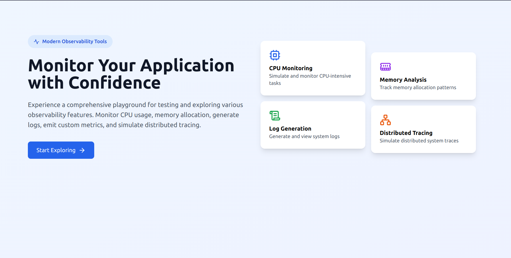
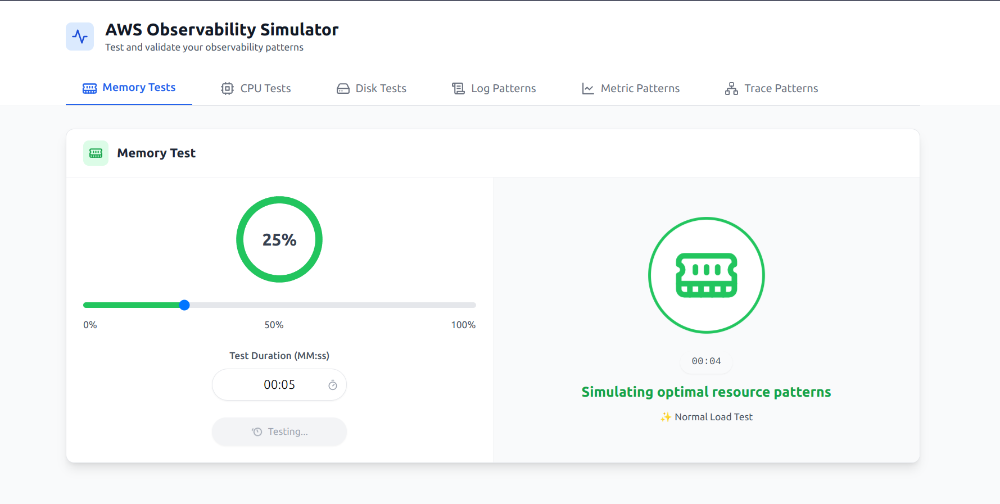

# AWS Observability Playground 🔍

A hands-on playground for testing and understanding AWS observability patterns. This interactive simulator helps you experiment with different resource usage scenarios and observe their impact on logs, metrics, and traces.

## 🎯 Purpose

This playground helps developers and DevOps engineers:

- Test observability patterns before production deployment
- Understand resource usage impact on observability signals
- Practice interpreting observability data
- Experiment with different monitoring scenarios

## 🖥 Preview


_Main dashboard showing resource simulation controls_


_Generated logs, metrics, and traces_

## 🚀 Quick Start

1. **Clone the repository**

   ```bash
   git clone [your-repo-url]
   cd observability-playground-app
   ```

2. **Start the Backend**

   ```bash
   cd backend
   pip install -r requirements.txt
   python app.py
   ```

3. **Start the Frontend**

   ```bash
   cd frontend
   npm install
   npm run dev
   ```

4. Open `http://localhost:5173` in your browser

## 🛠 Features

### Resource Simulation

- Memory usage patterns
- CPU utilization scenarios
- Disk I/O testing
- Configurable thresholds and durations

### Observability Signals

- **Logs**: Generate multi-level logging patterns
- **Metrics**: Emit custom metrics with various units
- **Traces**: Simulate distributed tracing scenarios

## 📱 Tech Stack

### Frontend

- React + TypeScript
- Tailwind CSS
- Framer Motion
- Lucide React icons

### Backend

- Flask
- Python
- AWS SDK (boto3)

## 📖 Documentation

For detailed documentation about each component:

- [Backend API Documentation](backend/README.md)
- [Frontend Component Guide](frontend/README.md)

## 🤝 Contributing

Contributions are welcome! Feel free to:

- Submit issues
- Propose new features
- Create pull requests

## 📄 License

[Your chosen license]
